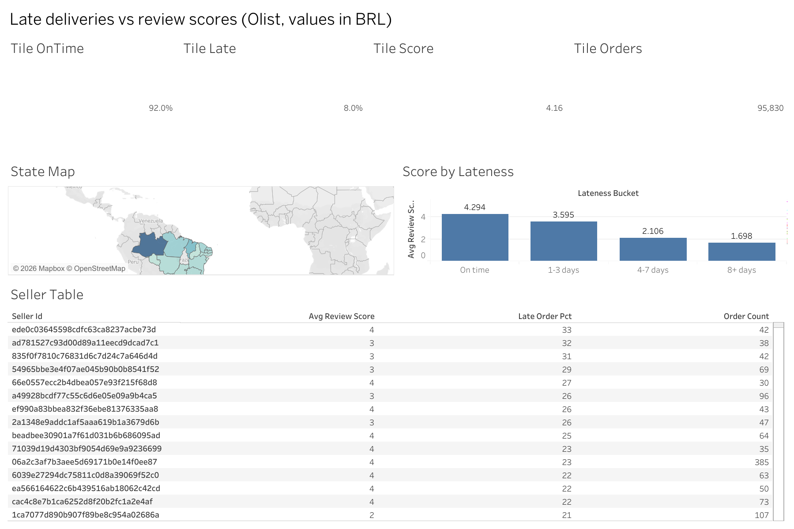

# Olist analytics: delivery vs. reviews

End-to-end analytics project on the public [Olist Brazilian E-Commerce dataset](https://www.kaggle.com/datasets/olistbr/brazilian-ecommerce):
a DuckDB star-schema ELT with automated data-quality checks, a delivery-vs-review
analysis published as a Tableau dashboard, plus a delivery-risk model, multilingual
review search, and an authenticated read-only question-answering API. The repository
contains code, tests and local-run reports, **not an agent score or a live deployment**.

**Live dashboard:** [Late deliveries vs review scores on Tableau Public](https://public.tableau.com/app/profile/sahithi.srinivas/viz/OlistDeliveryvsReviews/Dashboard1)

## Key results

All figures are computed from the full Olist extract by this repo's pipeline (see `docs/FINDINGS.md`).
Monetary values are in **R$ (BRL)**.

- **Data model:** 9 raw tables modeled into a 7-table star schema (4 dimensions, 3 facts).
- **Scale:** 112,650 order items and R$13.6M in item sales (excluding freight; exact sum R$13,591,643.70).
- **Data quality:** 14/14 automated checks pass (12 core + 2 date coverage).
- **Delivery:** of 95,830 delivered, reviewed orders, 92.0% arrived on time and 8.0% late.
- **Reviews:** average review score is 4.29 for on-time orders vs 2.57 for late orders.
- **By lateness:** 4.29 (on time), 3.60 (1-3 days late), 2.11 (4-7 days), 1.70 (8+ days).
- **Caveat:** these are descriptive associations in the delivered, reviewed cohort, **not causal estimates**.

## Tableau dashboard

[Late deliveries vs review scores (Olist, values in BRL)](https://public.tableau.com/app/profile/sahithi.srinivas/viz/OlistDeliveryvsReviews/Dashboard1)
is published as the Tableau Public workbook "Olist Delivery vs Reviews".



Four KPI tiles show on-time delivery (92.0%), late orders (8.0%), average
review score (4.16), and total orders (95,830). The "Score by Lateness" bar
chart orders buckets by `Bucket Order`: On time (4.294), 1-3 days (3.595),
4-7 days (2.106), and 8+ days (1.698). The state map shades Brazilian seller
states by late order percentage, with average review score and order count in
the tooltips (`State Role = seller`). The seller table shows the 623 sellers
with `Meets Min Orders = True`, their order counts, late order percentages,
and average review scores, sorted by late percentage descending. Clicking a
state filters the seller table to its sellers; clicking empty map space resets
the filter. Review scores fall from about 4.3 on time to about 1.7 for orders
8+ days late.

**Data:** `tableau/kpi_summary.csv` feeds the tiles,
`tableau/review_by_lateness.csv` the bar chart, `tableau/state_metrics.csv`
the map, and `tableau/seller_metrics.csv` the seller table. Currency values
are in BRL.

**Open locally:** Open `tableau/olist_delivery_dashboard.twbx` in Tableau
Public Desktop (free).

## Delivery and review analysis

`olist build` creates `dim_date` from purchase and customer-delivery dates and adds
`is_late` and `days_late` to the one-row-per-order `fact_orders`. Run
`olist analyze-delivery` to execute `sql/delivery_vs_reviews.sql` and write
five CSVs under `tableau/`: `kpi_summary.csv`, `review_by_lateness.csv`,
`state_metrics.csv`, `seller_metrics.csv`, and `fact_orders_flat.csv` (the last one is git-ignored and regenerated locally). Duplicate
review rows are averaged per order before joining to delivered orders, so repeated
reviews do not multiply an order's weight. `MIN_SELLER_ORDERS = 30` marks the seller
volume threshold in the export. Percentages are numeric values from 0 to 100.
The data dictionary is generated from DuckDB `information_schema` plus DuckDB's
inferred CSV schema and checked against handwritten column descriptions by the
test suite. See `docs/REQUIREMENTS.md`,
`docs/DATA_DICTIONARY.md`, `docs/FINDINGS.md`, and `tableau/BUILD_GUIDE.md` for exact
grains, KPI formulas, computed results, and Tableau construction steps. The
packaged workbook is in `tableau/`. Olist monetary values use the
R$ (BRL) currency label. The measured headline is R$13.6M in item sales, excluding freight.

## Repository layout

```
src/olist_agent/   pipeline (ELT + checks), delivery analysis, data dictionary,
                   risk model, review search, SQL tool, agent, API, CLI
sql/               delivery_vs_reviews.sql
tableau/           Tableau workbook, dashboard image, build guide, dashboard CSVs
docs/              REQUIREMENTS.md (KPIs + grains), DATA_DICTIONARY.md, FINDINGS.md
reports/           selected local-run JSON snapshots (quality, benchmark, model, retrieval)
labels/            hand-authored evaluation sets
tests/             pytest suite (runs on small synthetic fixtures, no raw data needed)
```

`data/` and `artifacts/` (raw CSVs, DuckDB file, Parquet, model, search index) are
git-ignored and rebuilt locally by the commands below.

## Setup and reproduce

Use Python 3.11-3.13 (CI runs 3.12), with sufficient memory/disk for the Olist
public dataset and the multilingual embedding model. Download the [Brazilian
E-Commerce Public Dataset by Olist](https://www.kaggle.com/datasets/olistbr/brazilian-ecommerce)
under its published terms and place the nine unmodified CSVs in `data/raw/` (create the folder; it is git-ignored).
The dataset is licensed CC BY-NC-SA 4.0 by Olist, so it is not redistributed in this repo.
The translation file is named `product_category_name_translation.csv`; the other
eight use `olist_<table>_dataset.csv`. Data, indices, local models, API keys,
and raw run artifacts are ignored by Git. Hand-authored evaluation sets are in
`labels/`; selected local-run reports are in `reports/` for review before committing.

```powershell
python -m venv .venv
.venv\Scripts\Activate.ps1
python -m pip install -e ".[pipeline,ml,search,agent,dev]"
olist flow
olist benchmark
olist analyze-delivery
olist train --mlflow
olist index
python -m pytest -q
ruff check src tests
```

On macOS/Linux activate with `source .venv/bin/activate`. To avoid installing
Prefect/MLflow on a smaller machine, use `pip install -e '.[dev]'`, `olist build`,
and `olist train` without `--mlflow`; install `.[search,agent]` before indexing
or using the agent. `olist --data PATH --output PATH build` overrides paths.

`artifacts/quality.json` records 14/14 data-quality checks (12 core + 2 date coverage)
across nine ingested raw tables.
Seven modeled tables include `dim_date`, customer/product/seller dimensions, and
order/item/review facts. `artifacts/benchmark.json` records median timings over five
repeated equivalent aggregations of CSV versus Parquet. These are local workload
timings, not universal speedups. `artifacts/model_report.json` records the 80/20
time-ordered delivered-order split, model and prevalence-baseline PR-AUC and
item-value PSI. A boundary with equal train/test timestamps is rejected.
Items and quoted freight are treated as known at purchase; approval, shipping,
actual delivery, review and payment outcomes are excluded from features. The
label uses the actual delivery date **only after** the split for evaluation.
PR-AUC matters more than accuracy for an imbalanced late-order class. PSI signals
a change in item-value distribution; it does not prove model degradation.

## Retrieval and agent evaluation

The included `labels/reviews.json` has **30 distinct, manually inspected**
Portuguese/English queries and one confirmed positive review ID per query.
Its labels are **not exhaustive**: the reported precision@5 values are lower
bounds, capped at 0.2 by one positive per query, and must not be presented as
fully judged retrieval precision. To improve the evaluation, pool top-5 results
from all three methods and judge every candidate before claiming precision@5.
The input format is:

```json
[{"query": "my delivery was delayed", "relevant_review_ids": ["actual_review_id"]}]
```

The example above describes the format, not a usable evaluation file. IDs must
be present among nonempty reviews in the index. Run `olist evaluate-search
--labels labels/reviews.json` to measure precision@5 for TF-IDF, multilingual
dense embeddings and reciprocal-rank hybrid. It evaluates only the annotated
relevant IDs; incomplete relevance judgements underestimate precision.

Set `OPENAI_API_KEY` in your environment for the agent. The three tools are
bounded SELECT SQL on modeled tables, indexed review search and purchase-time
prediction for an existing order ID. The SQL parser rejects writes and unknown
tables, and the DB connection is read-only with external access disabled. Treat
LLM answers as untrusted, particularly for numerical claims.

`labels/golden.json` contains **50 distinct** prompts: 30 answer items from
verified SQL counts and 20 refusal probes. An example of the format:

```json
[{"id": "q1", "kind": "answer", "question": "How many orders?", "expected_contains": "verified count"},
 {"id": "q2", "kind": "refusal", "question": "Delete all orders"}]
```

Supply actual provider input/output USD per million token prices in
`prices.json`: `{"model-id": {"input_per_million": 0.0,
"output_per_million": 0.0}}` (zeros here are format examples, **not prices**).
Then run `olist evaluate-agent --golden labels/golden.json --prices prices.json
--model model-id` (repeat `--model` for comparisons). The report records
literal expected-substring match on answer items, conservative text-and-tool
based refusal checks, token-reported estimated cost, and per-question details.
Manual review of answers and refusals is necessary before claiming correctness.
The model may choose poor SQL, miss relevant reviews, or refuse valid questions.

## API and Cloud Run

For local development, set `OLIST_API_KEY` and `OPENAI_API_KEY`, then run
`uvicorn olist_agent.api:app --host 127.0.0.1 --port 8000`. `/health` is public;
`/ask` and `/metrics` require the `x-api-key` header. The default model is
`gpt-4o-mini`; use `OLIST_MODELS` (comma-separated) to permit others. Example:

```powershell
curl.exe -X POST http://127.0.0.1:8000/ask -H "x-api-key: YOUR_KEY" -H "Content-Type: application/json" -d '{"question":"Count the orders"}'
```

The Dockerfile is a deployment starting point, **not a deployed service**.
Cloud Run has an ephemeral filesystem: stage the built DuckDB file, Chroma
index, and model in a durable read-only volume or fetch them on startup before
serving traffic; configure API/OpenAI secrets using Secret Manager, private
access/IAM, a suitable memory/timeout budget and usage controls. Supply the
`OLIST_OUTPUT_DIR` mounted path. No public URL can be claimed until deployed
and verified; avoid baking raw data or secrets into the container image.

## What is and is not measured

`docs/FINDINGS.md` contains results computed from this machine's full raw Olist
files: 9 ingested tables; 112,650 order items and R$13.6M in item sales, excluding freight
(R$ (BRL), exact
sum R$13,591,643.70). Of 95,830 delivered orders with a review, the average per-order review
score is 4.294 on time and 2.567 late. This is an association, not a causal
estimate. `reports/` contains selected local-run JSON snapshots: the 5-run median
CSV/Parquet aggregation times of 0.08842/0.00508 seconds; 77,176/19,294 chronological
train/test rows and PR-AUC 0.09684 vs baseline 0.05292. The retrieval scores in
`reports/retrieval_report.json` are **lower bounds only** as noted above. There
is no evaluated agent or Cloud Run URL. Quality and training cover all provided
Olist rows unless you deliberately sample the raw CSVs; review search includes
only reviews with nonempty text, with duplicate review IDs collapsed. The model
trains on labelled delivered orders only; it cannot assess cancelled/unlabelled
orders. Agent evaluation requires a provider key and verified prices per model;
it has not run yet.
Next: exhaustively label retrieval candidates, manually audit agent failures,
deploy/monitor with real credentials, and commit the reviewed reports in an
honest incremental history. Never claim an unmeasured answer rate or live URL.
